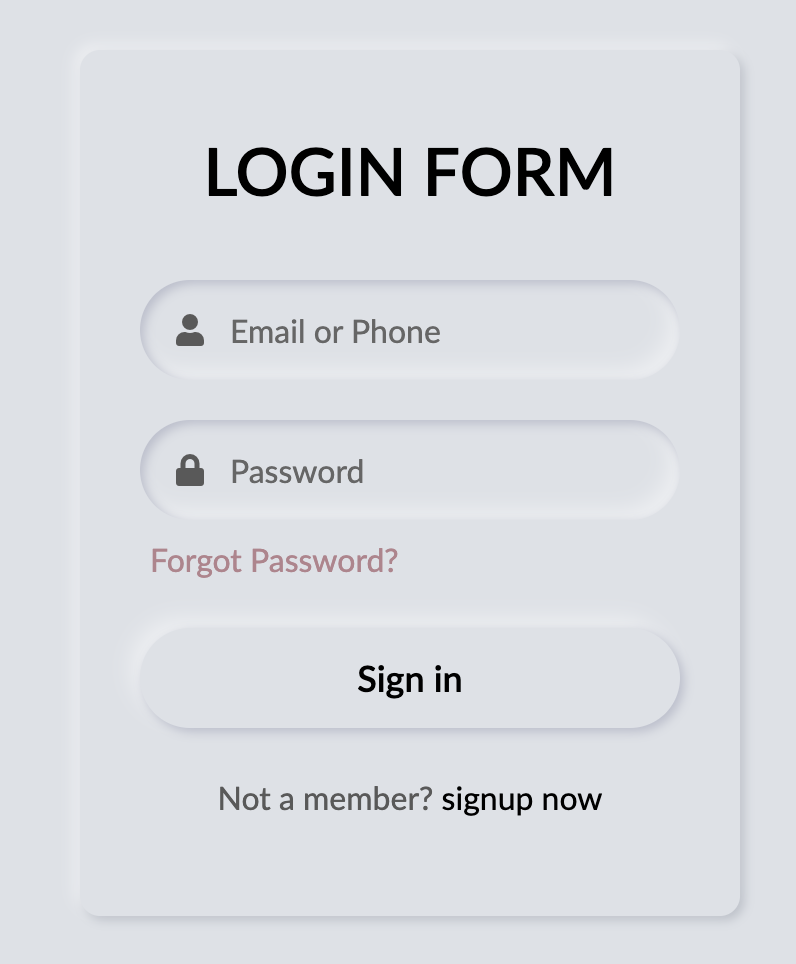

# Test-neumorphism
Mini projet pour comprendre la notion de neumorphism 

Réalisation d'une zone login

La partie login est disponible en cliquant sur le lien suivant : https://flower-dev.github.io/Test-neumorphism/

**Source** : https://dev.to/backlinkn/neumorphism-login-form-ui-design-using-html-css-3mj0 - article intéressant pour comprendre le neumorphism et réaliser pas à pas son premier formulaire 